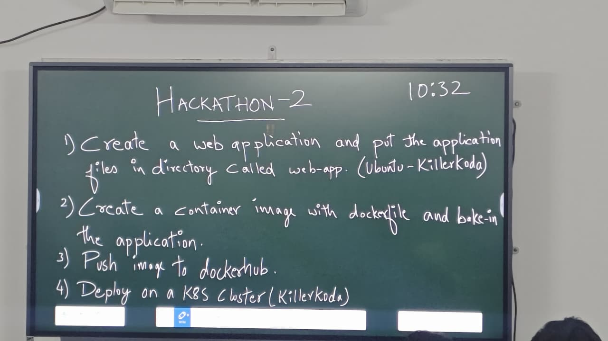
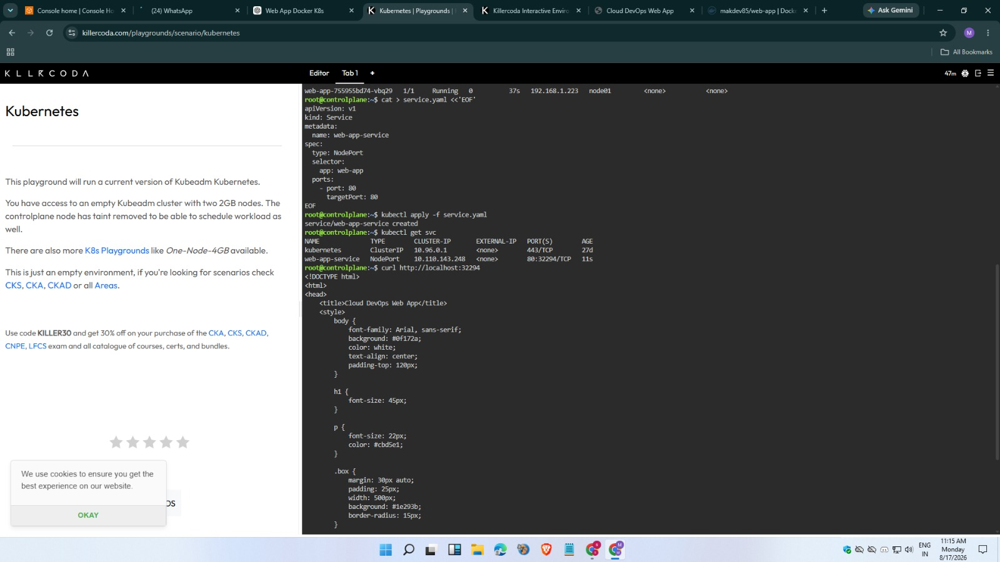
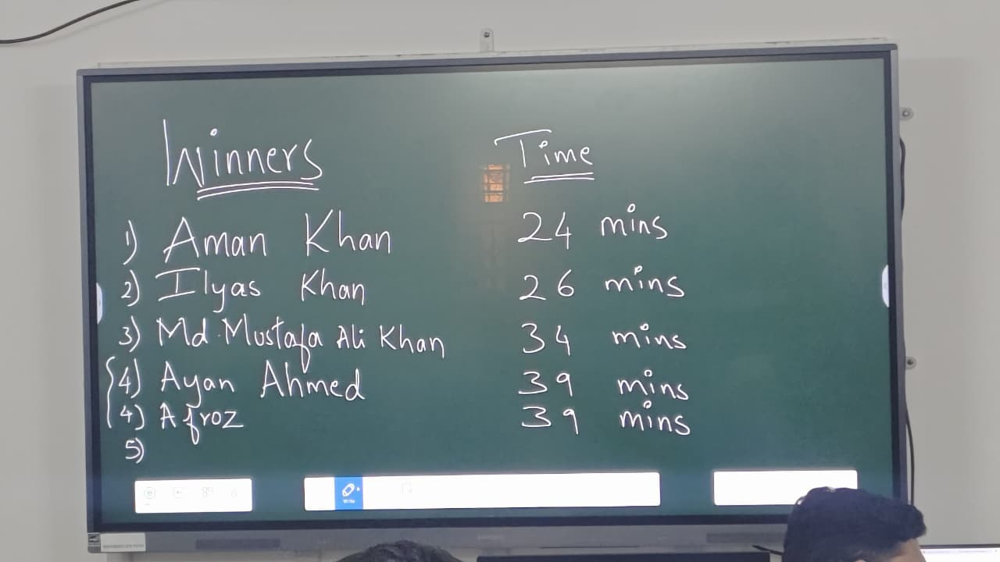

# Kubernetes Web Application Deployment

A web application containerized using **Docker** and deployed on a **Kubernetes cluster**. The project demonstrates the process of packaging an application into a Docker image, pushing the image to **DockerHub**, and deploying it to Kubernetes using deployment and service configurations.

## 🚀 Tech Stack

* HTML / CSS / JavaScript
* Docker
* DockerHub
* Kubernetes
* Linux / Ubuntu

## 🔄 Deployment Workflow

```text
Web Application
       ↓
   Dockerfile
       ↓
 Docker Image
       ↓
   DockerHub
       ↓
 Kubernetes Cluster
       ↓
 Deployed Application
```

## 📋 Challenge

The challenge required:

1. Creating a web application and placing the application files inside a `web-app` directory.
2. Creating a Docker image using a `Dockerfile`.
3. Pushing the Docker image to DockerHub.
4. Deploying the application on a Kubernetes cluster provided through KillerKoda.

### Challenge Brief

The original challenge instructions for Hackathon-2 at SD HUB.

<p align="center">
  
</p>

## 🐳 Docker

### Build the Docker Image

```bash
docker build -t <dockerhub-username>/<image-name>:latest .
```

### Login to DockerHub

```bash
docker login
```

### Push the Image

```bash
docker push <dockerhub-username>/<image-name>:latest
```

## ☸️ Kubernetes

### Deploy the Application

```bash
kubectl apply -f k8s/deployment.yaml
kubectl apply -f k8s/service.yaml
```

### Check the Deployment

```bash
kubectl get pods
kubectl get deployments
kubectl get services
```

## 🧪 KillerKoda Deployment

The application was deployed on the Kubernetes cluster provided through the KillerKoda environment.

A Kubernetes **Deployment** was created to manage the application pod, while a **NodePort Service** was used to expose the application.

<p align="center">
  
</p>

The deployment was successfully verified using Kubernetes commands, confirming that the application pod was running and the service was exposing the application.

## 🌐 Application Running

After building the Docker image, pushing it to DockerHub, and deploying it on Kubernetes, the application was successfully accessed through the exposed service.

<p align="center">
  
</p>

The successful result demonstrates the complete workflow:

**Application → Docker → DockerHub → Kubernetes → Running Application**

## 📁 Project Structure

```text
kubernetes-web-app-deployment/
│
├── web-app/
│   ├── index.html
│   ├── style.css
│   └── ...
│
├── screenshots/
│   ├── application-running.png
│   ├── challenge.png
│   ├── kubernetes-deployment.png
│   └── result.png
│
├── Dockerfile
│
├── k8s/
│   ├── deployment.yaml
│   └── service.yaml
│
└── README.md
```

## 💡 What I Learned

This challenge provided hands-on experience with:

* Containerizing web applications with Docker
* Building and tagging Docker images
* Publishing images to DockerHub
* Writing Kubernetes Deployment and Service configurations
* Deploying applications to a Kubernetes cluster
* Exposing applications using Kubernetes Services
* Managing applications through the Linux command line

## 🏆 Achievement

🥉 **3rd Position — KillerKoda DevOps Challenge at SD HUB**

⏱️ **Completed in 34 minutes**

The challenge was completed within **34 minutes**, resulting in a **3rd-place finish**.

## 🏅 Final Result

The final result announced at the end of the challenge.

<p align="center">
  
</p>

---

**Built as part of a KillerKoda DevOps Challenge 🚀**
